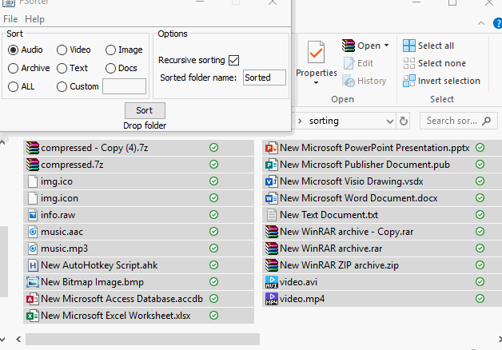

<a href="https://github.com/kubar123/FSorter-Java/releases/latest"/> <a href="https://github.com/kubar123/Fsorter-Java/releases/latest/download/Fsorter.exe"/> 
# FSorter-Java

Drop a folder, hit go, and the files will be sorted into folders. No setup or configuration required.


# Command usage

FSorter.jar "[audio|video|image|text|archive|docs]" "new folder name" "folder to sort"

Example usage:

```cmd
FSorter.jar "image" "sorted-images" "C:\Users\Admin\Downloads"
```

Will move all 'image' in the 
'C:\Users\Admin\Downloads'
 into the 'C:\Users\Admin\Downloads\sorted-images' folder.


